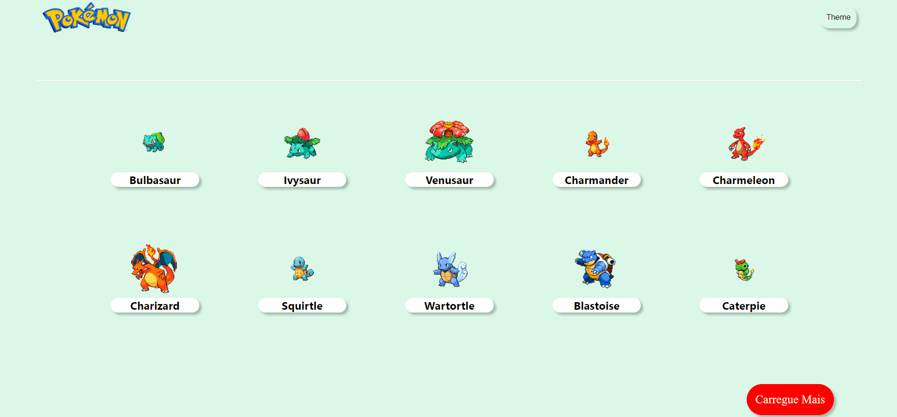
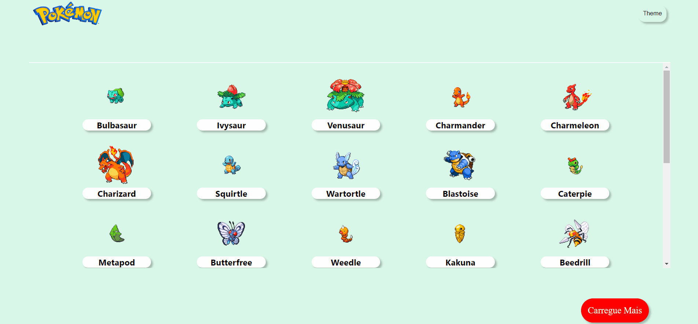
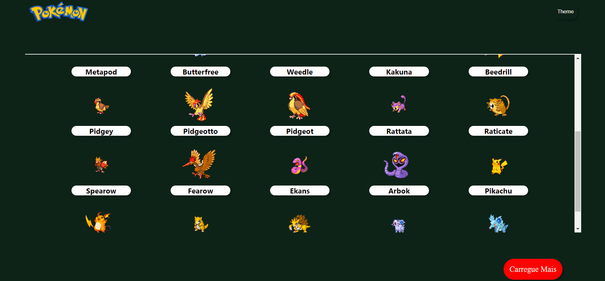

# Pokédex - PokéApi

## Descrição da Aplicação:
O propósito desta aplicação é exibir uma lista com dez pokémon contendo sua imagem e nome.

Ao clicar em qualquer pokémon da lista, o usuário será levado a uma página com detalhes de seu pokémon escolhido.

### Funcionalidade:

Adicionando mais Pokémon.

Mudando o Tema entre ligth/dark.

Detalhes do Pokémon.

Voltando Para Lista Principal

### Ferramentas Utilizadas:

**JavaScript + React** - *Para a aplicação ser Single Page Application (SPA).*

**Context Api** - *Para a criar o alterador entre o tema ligth e dark.*

**Styled-components** - *Para estilização dos componentes.*

**React-router-dom** - *Para a navegação entre as páginas.*

### Decisões:
Sem dúvidas foi desafiador todo o planejamento desse projeto, optei então por um design minimalista, para dar todo foco na funcionalidade.

## Quer rodar esse projeto no seu computador?
- Para clonar/baixar esse projeto, siga as solicitações do GitHub. 
- Usar um editor de código de sua preferência para abrir o projeto.
- Passando o comando "npm install" no terminal, será instalados os pacotes que foram utilizados.

